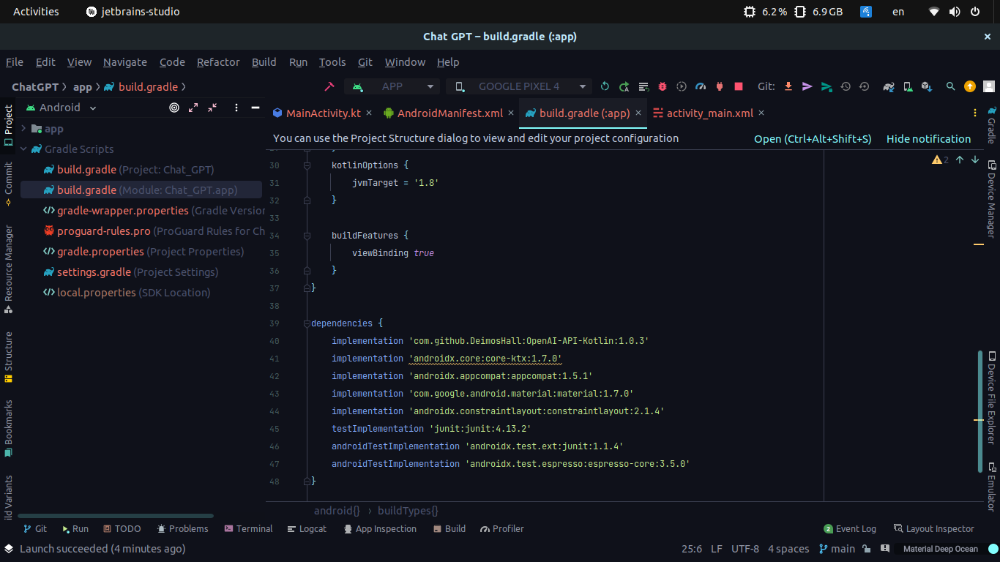
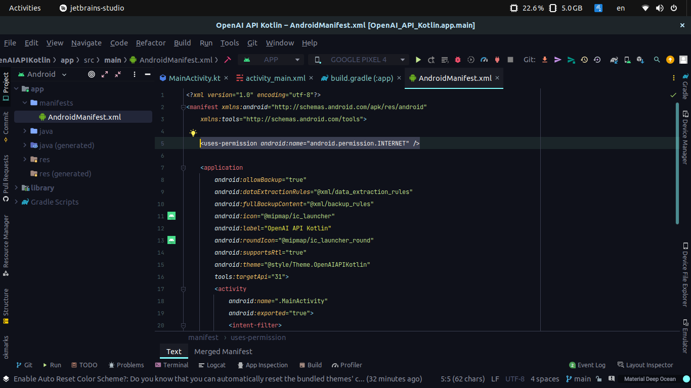
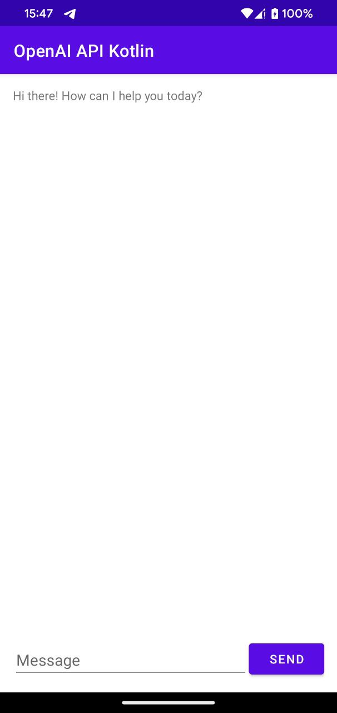

# OpenAI API for Android/Kotlin
Do you want to build your own Chat GPT? Well, you can find an example
here! If you have any issues please let me know it in some of my
social networks, you can find them
[here](https://github.com/DeimosHall).

## Add the dependencies to you project

Open the build.gradle (app) file and add the dependencies.

~~~
dependencies {
	implementation 'com.github.DeimosHall:OpenAI-API-Kotlin:1.0.3'
	...
}
~~~

If you want to follow the example you will also need

~~~
android {
	...
	buildFeatures {
        viewBinding true
    }
}
~~~

Remember to give a star to the project :D

	

## Permissions

Your app will need the internet permission, add it in the
AndroidManifest.xml file

~~~
<uses-permission android:name="android.permission.INTERNET" />
~~~

	

## User interface
You can skip this step if you just want to see the code. However,
if you want to get the same behavior you can copy the code of the
activity_main.xml from bellow.

	

activity_main.xml:

~~~
<?xml version="1.0" encoding="utf-8"?>
<androidx.constraintlayout.widget.ConstraintLayout xmlns:android="http://schemas.android.com/apk/res/android"
    xmlns:app="http://schemas.android.com/apk/res-auto"
    xmlns:tools="http://schemas.android.com/tools"
    android:layout_width="match_parent"
    android:layout_height="match_parent"
    android:padding="15dp"
    tools:context=".MainActivity">

    <TextView
        android:id="@+id/tvResponse"
        android:layout_width="0dp"
        android:layout_height="0dp"
        android:text="Hi there! How can I help you today?"
        app:layout_constraintBottom_toTopOf="@+id/etMessage"
        app:layout_constraintEnd_toEndOf="parent"
        app:layout_constraintStart_toStartOf="parent"
        app:layout_constraintTop_toTopOf="parent" />

    <EditText
        android:id="@+id/etMessage"
        android:layout_width="0dp"
        android:layout_height="wrap_content"
        android:hint="Message"
        android:inputType="textCapSentences"
        app:layout_constraintStart_toStartOf="parent"
        app:layout_constraintEnd_toStartOf="@+id/btnSend"
        app:layout_constraintBottom_toBottomOf="parent" />

    <Button
        android:id="@+id/btnSend"
        android:layout_width="wrap_content"
        android:layout_height="wrap_content"
        android:text="Send"
        app:layout_constraintEnd_toEndOf="parent"
        app:layout_constraintBottom_toBottomOf="parent" />

</androidx.constraintlayout.widget.ConstraintLayout>
~~~

## Kotlin implementation
First, we need to create the binding between the view and the logic.
In the MainActivity.kt we add:

~~~
class MainActivity : AppCompatActivity() {

    private lateinit var binding: ActivityMainBinding

    override fun onCreate(savedInstanceState: Bundle?) {
        super.onCreate(savedInstanceState)
        binding = ActivityMainBinding.inflate(layoutInflater)
        setContentView(binding.root)
~~~

After that, we can create the openAI instance. To get your API key,
click on [this](https://beta.openai.com/account/api-keys) link.

~~~
val API_KEY = "Bearer $MY_API_KEY" // Replace MY_API_KEY with your own key and keep the word Bearer
val openAI = OpenAI(API_KEY)
// You can change the prompt, this is what we find in the chat example from the OpenAI page
var prompt = "The following is a conversation with an AI assistant. The assistant is helpful, creative, clever, and very friendly."
~~~

If you want to explore different prompts, click on
[this](https://beta.openai.com/examples/) link.

Now we define some functions we're going to need.

~~~
private fun deleteTVMessage() {
    binding.etMessage.setText("")
}

private fun hideKeyboard() {
    val activityView = this.window.decorView
    val imm = activityView.context.getSystemService(Context.INPUT_METHOD_SERVICE) as InputMethodManager
    imm.hideSoftInputFromWindow(activityView.windowToken, 0)
}
~~~

In the click event on the button, we add the following code:

~~~
binding.btnSend.setOnClickListener {
        val message = binding.etMessage.text.toString()
        deleteTVMessage()
        hideKeyboard()

        CoroutineScope(Dispatchers.IO).launch {
            prompt += "\n\nHuman: $message \nAI:"

            try {
                val response = openAI.createCompletion(
                    model = "text-davinci-003",
                    prompt = prompt,
                    temperature = 0.9,
                    max_tokens = 150,
                    top_p = 1,
                    frequency_penalty = 0.0,
                    presence_penalty = 0.6,
                    stop = listOf(" Human:", " AI:")
                )

                if (response.isSuccessful) {
                    var answer = response.body()?.choices?.first()?.text
                    answer = answer?.trimStart() // Delete the first space from the answer

                    runOnUiThread {
                        binding.tvResponse.text = answer
                    }
                } else {
                    Log.d("RESPONSE", "Error: ${response.code()} ${response.message()}")
                }
            } catch (e: Exception) {
                Log.d("RESPONSE", "Error: $e")
            }
        }
    }
~~~

It's important to use the next line to hold the context on the
conversation.

~~~
prompt += "\n\nHuman: $message \nAI:"
~~~

I hope everything is ok at this point, but if you have problems you
can copy all the code, just replace the name of the package for
your own.

~~~
package com.deimos.openaiapikotlin

import MY_API_KEY
import android.content.Context
import androidx.appcompat.app.AppCompatActivity
import android.os.Bundle
import android.util.Log
import android.view.inputmethod.InputMethodManager
import com.deimos.openaiapi.OpenAI
import com.deimos.openaiapikotlin.databinding.ActivityMainBinding
import kotlinx.coroutines.CoroutineScope
import kotlinx.coroutines.Dispatchers
import kotlinx.coroutines.launch

class MainActivity : AppCompatActivity() {

    private lateinit var binding: ActivityMainBinding

    override fun onCreate(savedInstanceState: Bundle?) {
        super.onCreate(savedInstanceState)
        binding = ActivityMainBinding.inflate(layoutInflater)
        setContentView(binding.root)

        val API_KEY = "Bearer $MY_API_KEY" // Replace MY_API_KEY with your own key and keep the word Bearer
        val openAI = OpenAI(API_KEY)
        // You can change the prompt, this is what we find in the chat example from the OpenAI page
        var prompt = "The following is a conversation with an AI assistant. The assistant is helpful, creative, clever, and very friendly."

        binding.btnSend.setOnClickListener {
            val message = binding.etMessage.text.toString()
            deleteTVMessage()
            hideKeyboard()

            CoroutineScope(Dispatchers.IO).launch {
                prompt += "\n\nHuman: $message \nAI:"

                try {
                    val response = openAI.createCompletion(
                        model = "text-davinci-003",
                        prompt = prompt,
                        temperature = 0.9,
                        max_tokens = 150,
                        top_p = 1,
                        frequency_penalty = 0.0,
                        presence_penalty = 0.6,
                        stop = listOf(" Human:", " AI:")
                    )

                    if (response.isSuccessful) {
                        var answer = response.body()?.choices?.first()?.text
                        answer = answer?.trimStart() // Delete the first space from the answer

                        runOnUiThread {
                            binding.tvResponse.text = answer
                        }
                    } else {
                        Log.d("RESPONSE", "Error: ${response.code()} ${response.message()}")
                    }
                } catch (e: Exception) {
                    Log.d("RESPONSE", "Error: $e")
                }
            }
        }

        binding.tvResponse.setOnClickListener { hideKeyboard() }
    }

    private fun deleteTVMessage() {
        binding.etMessage.setText("")
    }

    private fun hideKeyboard() {
        val activityView = this.window.decorView
        val imm = activityView.context.getSystemService(Context.INPUT_METHOD_SERVICE) as InputMethodManager
        imm.hideSoftInputFromWindow(activityView.windowToken, 0)
    }
}
~~~

And that's it! Try the app! If you liked it please give a star to
the repository.