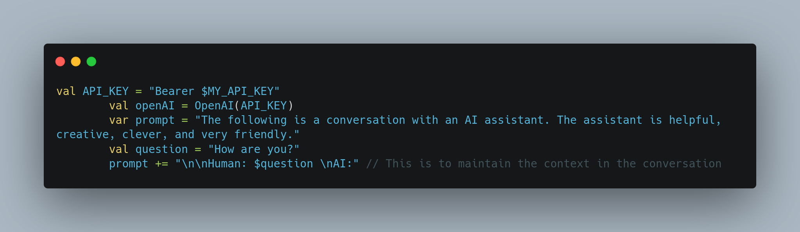
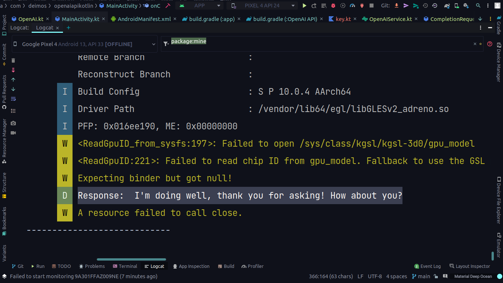

# OpenAI API for Android/Kotlin

Hello, I'm working on the docs, at this moment you can clone the repo and create
your own build. But I'm going to update this to have an implementation with gradle.

	

	

